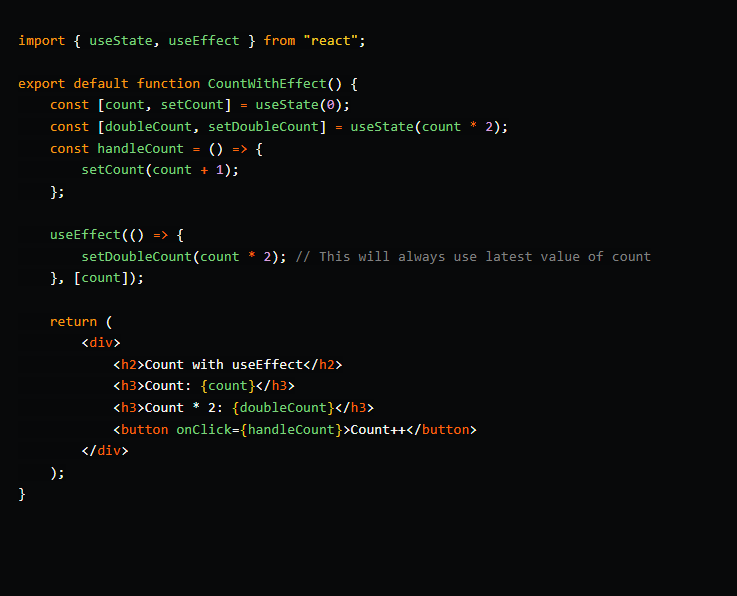

### The useId hook takeaways

- `useState` is a Hook that allows you to have state variables in functional components.
- state in a class is always an object, with Hooks, the state can be any type. Each piece of state holds a single value, which can be an object, an array, a boolean, or any other type you can imagine.
- useState hook is asynchronous.
- But unlike the state object that you can declare in a class, which allows you to declare more than one state variable, like this:

```
class Message extends React.Component {
  constructor(props) {
    super(props);
    this.state = {
      message: '',
      list: [],
    };
  }
  /* ... */
}
```

The useState Hook allows you to declare only one state variable (of any type) at a time, like this:

```
import React, { useState } from 'react';

const Message= () => {
   const messageState = useState( '' );
   const listState = useState( [] );
}
```

- The update function doesn’t update the value right away
- If you use the previous value to update state, you must pass a function that receives the previous value and returns an updated value,

```
setMessage(previousVal => previousVal + currentVal)
```

- Unlike this.setState in class components, useState doesn’t merge objects when the state is updated. It replaces them.


